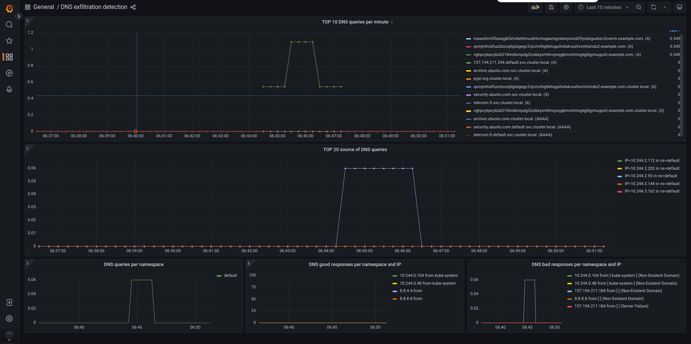

# From scratch to DNS exfiltration detection with logs 
## Création du cluster
```
$kind create cluster --config=kind-config.yaml
```

## Installation de Cilium CLI
https://docs.cilium.io/en/stable/gettingstarted/k8s-install-default/#install-the-cilium-cli

## Installation de Cilium avec Helm 
```
$helm repo add cilium https://helm.cilium.io/
$helm install cilium cilium/cilium --namespace kube-system`
```

Puis vérification : 
```
$helm list -n kube-system`
$cilium status
```

Et teste de connectivité (ce test prend du temps):
```
$cilium connectivity test
```

Si le test échoue lors du déploiement des pods, augmenter les limites des ressources inotify : 
```
$sudo sysctl fs.inotify.max_user_instances=512
$sudo sysctl fs.inotify.max_user_watches=524288
```

## Installer Hubble CLI
https://docs.cilium.io/en/stable/gettingstarted/hubble_setup/#install-the-hubble-client

## Installer Hubble avec helm
Pour pouvoir exporter les network flow logs, il faut installer la version >=1.16.0 de cilium 

Attention ! Pour pouvoir utiliser l'exportation des logs, il faut upgrade cilium en une version plus récente cilium ([lien pour plus d'infos](https://docs.cilium.io/en/latest/observability/hubble-exporter/)): 
```
$curl -LO https://github.com/cilium/cilium/archive/main.tar.gz
$tar xzf main.tar.gz
$cd cilium-main/install/kubernetes
$helm upgrade cilium ./cilium --namespace kube-system --set hubble.enabled=true --set hubble.export.static.enabled=true --set hubble.export.static.filePath=/var/run/cilium/hubble/events.log
```
Puis on déploie Hubble Relay et Hubble UI : 
```
$helm upgrade cilium cilium/cilium ./cilium --namespace kube-system --reuse-values --set hubble.relay.enabled=true --set hubble.ui.enabled=true`
```
## Vérifier Hubble et Hubble UI 
```
$cilium status
```

Pour rappel : 

Pour rendre accessible Hubble Relay (dans une autre console, idéalement tmux)
 : 
```
$cilium hubble port-forward
``` 
Ensuite, pour vérifier l'état d'Hubble avec Hubble CLI : 
```
$hubble status
```

Pour utiliser hubble ui : 
```
$cilium hubble ui
```
Pour hubble ui, besoin d'un browser, donc potentiellement d'un proxy
Par exemple : 
```
$caddy reverse-proxy --from :8080 --to localhost:12000
```


## Permettre de la visibilité L7
Enfin, on ajoute une règle DNS pour permettre la visibilité L7 (https://docs.cilium.io/en/stable/observability/visibility/#proxy-visibility)
```
$kubectl apply -f shallow-rule.yaml
```

## Générer du traffic:
```
$kubectl apply -f python-exfiltration/python-pod.yaml
$kubect exec -it python-script-runner -- bin/bash
$python3 dns_exfiltration_official.py
```

## Visualiser les logs avec Hubble CLI
```
$hubble observe --protocol dns
```

## Vérifier que les logs sont exportés
```
$kubectl exec -n kube-system $CILIUM_POD -- cat /var/run/cilium/hubble/events.log | grep dns | tail 5
```
Avec CILIUM_POD le pod cilium qui tourne sur le même noeud que python-script-runner. Ici, il n'y a qu'un seul worker node, mais dans un cluster avec de nombreux noeuds, bien sélectionner le bon noeud pour extraire les logs exportés. 
Sinon, utiliser un log aggregator. Dans ce projet, loki avec promtail ont été essayé pour afficher les logs dans grafana, mais sans succès : des logs de cilium sont bien remontés jusqu'à grafana, mais je n'ai pas réussi à faire remonter les network flow logs. 

## Récupérer les logs 
Modifier CILIUM_POD dans log-processing/fetch.sh 
```
$cd PRIM_Cilium/log-processing
$./fetch.sh
```
(limite actuelle : un seul cilium pod consulté)

## Détection des exfiltrations DNS

Librairies python requises:
- pandas
- numpy
- tensorflow

```
$python3 classify-dns.py
```

Ce script python utilise un réseau de neuronnes (MLP) dont les informations (jupyter notebook) sont dans DNS_exfiltration_classifier.pdf.


## Limite de la détection
Le réseau utilisé s'appuie sur un dataset composé d'attaques faites avec encodage. Ainsi, le réseau entrainé utilisé détecte bien les exfiltrations DNS mais que lorsque le contenu des queries est encodé (92% des attaques du test set sont détectées). En particulier, c'est l'entropie de la query qui est décisif dans la détection.
Cependant, l'attaquant pourrait réaliser des attaques avec un encodage avec une faible entropy, ce qui permettrait d'esquiver la détection. C'est ce que l'article à l'origine du dataset [link](https://link.springer.com/article/10.1007/s10207-023-00723-w) pointe du doigts. Fort heureusement, ils indiquent également une méthode pour s'adapter à ce genre d'attaques : utiliser des features aggrégées. Par manque de temps, ce cas n'a pas été abordé, mais d'après les résultats de l'article, il est théoriquement possible de detecter ces attaques plus discrètes, simplement en ajoutant de nouvelles features. 


## Generate customized traffic
```
$kubectl apply -f ubuntu-pod/ubuntu-pod.yaml
$kubectl exec -it ubuntu-network-tools-pod -- /bin/bash
```
Then you can "dig" the queries you want 
For automatic DNS exfiltration tools, see "generate traffic", there are 3 python scripts to do so

Par exemple : 

Remarque : ici, on voit un faux positif, mais que des vrais positifs 

# From scratch to DNS exfiltration detection with dashboards
## Création du cluster
```
$kind create cluster --config=kind-config.yaml
```

## Installation de Cilium CLI
https://docs.cilium.io/en/stable/gettingstarted/k8s-install-default/#install-the-cilium-cli

## Installation de Cilium avec Helm 
```
$helm repo add cilium https://helm.cilium.io/
$helm install cilium cilium/cilium --namespace kube-system
```


Puis vérification : 
```
$helm list -n kube-system`
$cilium status
```
Et teste de connectivité (ce test prend du temps): 
```$cilium connectivity test```


Si le test échoue lors du déploiement des pods, augmenter les limites des ressources inotify : 
```
$sudo sysctl fs.inotify.max_user_instances=512
$sudo sysctl fs.inotify.max_user_watches=524288
```

## Installer Hubble avec helm
Pour installer Hubble, il suffit de modifier les values de cilium dans Helm. Ensuite, pour configurer Hubble, cela se passe encore par ces values
Installer Hubble et modifier les metrics ne me posait aucun problème, mais en essayant de recommencer depuis le début, je rencontre un problème. Pour une raison qui m'échappe, le pod Hubble-relay ne fonctionne plus ("can't find peers") dans certains cas. 

Pour le faire fonctionner, je dois utiliser la configuration de helm suivante : 
```
$helm install cilium cilium/cilium --version 1.15.6 \
  --namespace kube-system \
  --set prometheus.enabled=true \
  --set operator.prometheus.enabled=true \
  --set hubble.enabled=true \
  --set hubble.metrics.enableOpenMetrics=true \
  --set hubble.metrics.enabled="{dns:query,drop,tcp,flow,port-distribution,icmp,httpV2:exemplars=true;labelsContext=source_ip\,source_namespace\,source_workload\,destination_ip\,destination_namespace\,destination_workload\,traffic_direction}"
$helm upgrade cilium cilium/cilium --version 1.15.6 \
   --namespace kube-system \
   --reuse-values \
   --set hubble.relay.enabled=true \
   --set hubble.ui.enabled=true
```
## Installer Hubble UI
https://docs.cilium.io/en/stable/gettingstarted/hubble_setup/#install-the-hubble-client

## Vérification de l'état d'Hubble
```
$cilium status
```

Pour rappel : 

Pour rendre accessible Hubble Relay (dans une autre console, idéalement tmux): 
```$cilium hubble port-forward``` 

Ensuite, pour vérifier l'état d'Hubble avec Hubble CLI : ```$hubble status```

Pour utiliser hubble ui : ```$cilium hubble ui``` 
Pour hubble ui, besoin d'un browser, donc potentiellement d'un proxy
Par exemple : ```$caddy reverse-proxy --from :8080 --to localhost:12000```


## Installer Grafana et Prometheus
```bash
$helm repo add grafana https://grafana.github.io/helm-charts
$helm repo add prometheus-community https://prometheus-community.github.io/helm-charts
$helm install grafana grafana/grafana --namespace monitoring --create-namespace
$helm install prometheus prometheus-community/prometheus --namespace monitoring
```
## Exposer grafana
```$kubectl port-forward -n monitoring $GRAFANA_POD_NAME 3000```
Puis reverse proxy caddy si besoin 

Suivre les instructions données lors de l'installation de Grafana pour les identifiants 

## Exposer prometheus
```$kubectl port-forward -n monitoring $PROMETHEUS_SERVER_POD_NAME 9090```

## Permettre de la visibilité L7
Enfin, on ajoute une règle DNS pour permettre la visibilité (https://docs.cilium.io/en/stable/observability/visibility/#proxy-visibility)
```$kubectl apply -f shallow-rule.yaml```

## Générer du traffic:
```
$kubectl apply -f python-exfiltration/python-pod.yaml
$kubect exec -it python-script-runner -- bin/bash
$python3 dns_exfiltration_official.py
```

Attention : pour que les metrics fonctionnent (customisation des labels), il faut avoir une version de Cilium >1.15.0
(lors de mes premières tentatives, la modification des metrics fonctionnait bien dès que la version de Cilium était correcte. Mais depuis que j'ai essayé de tout recommencer, je ne parviens plus à modifier les metrics. Avec les instructions ci-dessus, j'obtiens les metrics, mais je n'arrive pas à les modifier, si bien qu'obtenir les dashboards ci-dessous n'est plus possible. Heureusement, les ayant obtenu une fois, le proof of concept est validé)

## Modifier les metrics
https://docs.cilium.io/en/stable/observability/metrics/
Voici comment modifier les metrics dans hubble : (quand cela fonctionne) 
- Modifier le fichier values.yaml qu'utilise Helm
- Appliquer ces changements : `helm upgrade cilium cilium/cilium --namespace kube-system --values Cilium/cilium-values.yaml `
- Relancer Hubble : `kubectl rollout restart deployment hubble-relay -n kube-system`
- Simuler traffic
- Fetch les metrics sur prometheus. Eventuellement relancer le port forward (à cause du restart)
- Si jamais prometheus n'affiche rien, aller chercher les metrics directement depuis son endpoint, cad le port 9965 du noeud identifié

## Générer des dashboards 
Des exemples de dashboards pertinents pour les détecter des exfiltration DNS haut débit sont dans le dossier grafana-dashboards.

Lorsque les metrics pouvaient être modifié, j'obtenais par exemple le dashboard suivant : 


Grâce à lui, on peut facilement repérer une anomalie dans le traffique DNS (quantité, destinataire, queries étranges).
Pour parer au cas où l'exfiltration DNS se fait en faible débit, on utilise les network flow logs (voir plus haut).
